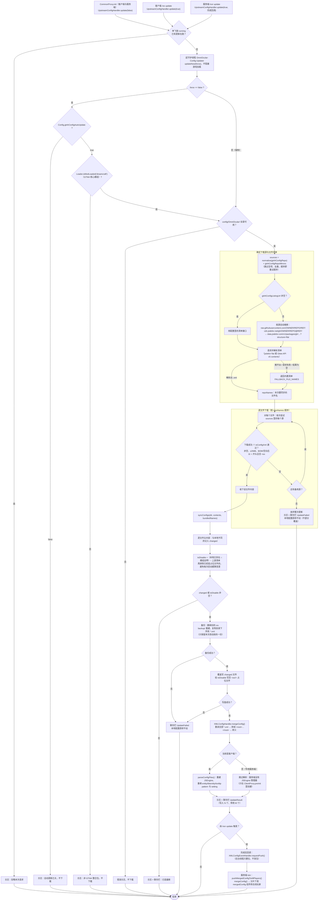
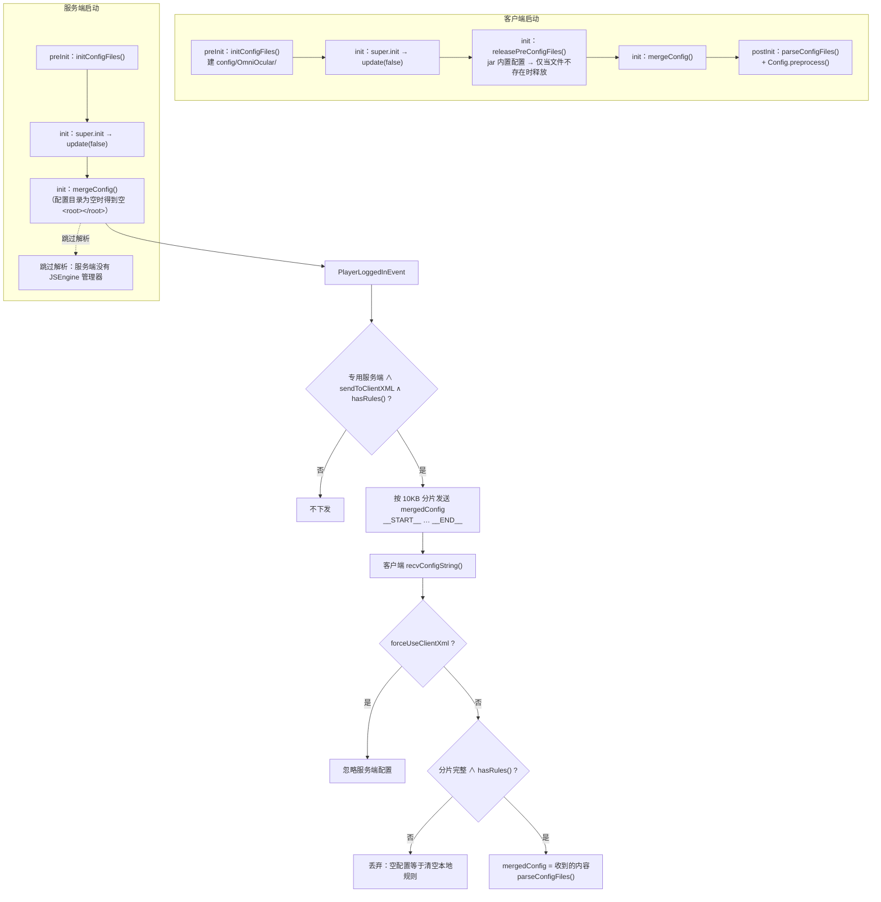

# OmniOcular 配置更新流程

对应代码：`UpstreamConfigHandler`（下载/落盘）、`XMLConfigHandler`（合并/解析）、
`XMLConfigMessageHandler`（服务端下发）、`Config`（配置项）。

## 触发点

| 触发 | 入口 | `force` | 受 `gtnhConfigAutoUpdate` / GTNH 检测约束 |
| --- | --- | --- | --- |
| 模组 init（客户端与服务端都跑） | `CommonProxy#init` | `false` | 是 |
| `/oo update`（客户端命令） | `CommandLookFor#processCommand` | `true` | 否（开发环境也能手动跑） |
| `/oor update`（服务端命令） | `CommandReloadConfig#processCommand` | `true` | 否（同上；完成后把新配置推给在线玩家） |

## 一、更新主流程



## 二、占位文件为什么是空 `<oo/>` 而不是删文件

`releasePreConfigFiles` 只在**文件不存在**时释放 jar 内置配置，删掉的话下次启动会被塞回来；
而内置 `GregTech5U.xml` 与仓库 `GregTech5U-GTNH.xml` 都定义了 `id="BaseMetaTileEntity"`，
`JSEngine` 会对所有匹配 pattern 都执行（没有 break），两者共存会让 GT 机器每行 tooltip 显示两遍。
写占位文件让"文件存在"成立 → 内置版本不再释放，空 `<oo/>` 又不会贡献任何规则。

## 三、更新结果如何到达每一端



## 四、其它相关命令

| 命令 | 端 | 行为 |
| --- | --- | --- |
| `/oo update` | 客户端 | 强制跑一次上游更新（忽略开关与 GTNH 检测），已在跑则聊天栏提示 |
| `/oo reload` | 客户端 | 只跑 `Config.preprocess()`（重算黑名单方块），不重新合并/下载 |
| `/oor` | 服务端（权限 3） | `mergeConfig()` 后把新配置下发给所有在线玩家；空配置同样拦下不发 |
| `/oor update` | 服务端（权限 3） | 强制跑一次上游更新；完成后由服务端 tick 重新 merge 并推给在线玩家。更新失败时内容未变，等于空刷一遍配置 |

`/oor update` 解决的是"服务器配置更新了、在线玩家手里还是旧规则"：更新在后台线程跑
（不能阻塞服务端），推送必须回到服务端线程（`playerEntityList` 不线程安全），
所以用 `requestPush()` 置位、tick 里做。

客户端的 `forceUseClientXml` 打开后完全不用服务端下发的配置；`sendToClientXML` 是服务端侧的开关。

## 五、配置示例：指向 Gitee 镜像

国内直连 GitHub 困难时，可以把更新源指向 Gitee 镜像（`config/OmniOcular.cfg`）：

```properties
gtnhConfigRepo=https://gitee.com/luomolhx/GTNH_OmniOcular/raw/master/
gtnhConfigListingUrl=https://gitee.com/api/v5/repos/luomolhx/GTNH_OmniOcular/contents/?ref=master
gtnhConfigRepoMirrors=   # 留空；或填默认仓库的 jsdelivr 地址作为回退
```

- 仓库必须**公开**：私有仓库的 raw 与 API 都要 token，本模组不带认证。
- raw 地址会 302 到 `raw.giteeusercontent.com`，`HttpURLConnection` 同协议自动跟随（已实测 200）。
- Gitee 的 WAF **按 UA 拦截**：旧版 IE UA 直接 403，`HttpUtil` 已改用现代浏览器 UA。
- Gitee API 匿名限流 60 次/小时/IP，每次更新只调一次；拿不到清单时退回内置清单
  （当前镜像的 24 个文件与内置清单完全一致，只是以后新增文件要等发版）。
- `parseFileNames` 同时认 Gitee contents 的数组响应与 jsdelivr 的 flat 响应。
